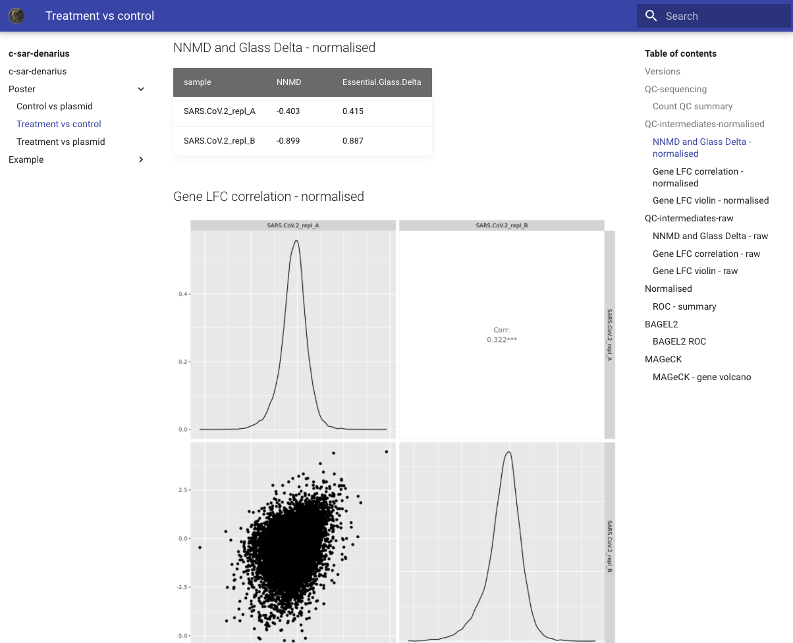

# c-sar-denarius

Provides a simple interface over results generated by [`c-sar`][csar-repo] using [mkdocs-material][mkdocs-mat].

[](https://circleci.com/gh/cancerit/c-sar-denarius)

- [Publications](#publications)
- [Commands](#commands)
  - [markdown](#markdown)
  - [server](#server)
- [Installation](#installation)
  - [Pypi](#pypi)
  - [Docker and Singularity](#docker-and-singularity)
- [Development environment](#development-environment)
  - [Python env](#python-env)
  - [Updating licence headers](#updating-licence-headers)
- [LICENSE](#license)



## Publications

Please contact the following for appropriate referencing methods:

- Keiran Raine (kr2@sanger.ac.uk)
- Clare Pacini (cp16@sanger.ac.uk)
- Victoria Offord (vo1@sanger.ac.uk)

## Commands

Basic command line information is provided by running the bare command:

```bash
$ c-sar-denarius
Usage: c-sar-denarius [OPTIONS] COMMAND [ARGS]...

Options:
  --version  Show the version and exit.
  --help     Show this message and exit.

Commands:
  markdown  Generate (or extend existing) c-sar-denarius site from a...
  server    Serve the result of a pre-existing target area.
```

Each subcommand has more detailed documentation.

### markdown

This command will generate or extend an existing target location using data from the `c-sar` results folder.

Please see `--help` on the subcommand for details of the options.

### server

Provides a basic webserver on the current host to serve the generated site.  Basic authentication is provided for use on
an internal network, but this is only intended for use by a small number of users.  Consider using a more robust server
for long term presentation of data.

Please see `--help` on the subcommand for details of the options.

## Installation

### Pypi

```bash
pip install c-sar-denarius
# for basic server components
pip install https://github.com/elfgoh/sauth/archive/15dbca865332e7b83ccf5d9d227d0321a88132ca.tar.gz
```

### Docker and Singularity

There are pre-built images containing this codebase on [quay.io][quay-repo].  When pulling an image you must specify
the version there is no `latest`.

The docker images are known to work correctly after import into a singularity image.

## Development environment

This allows you to run all appropriate pre-commit tests.

### Python env

```bash
python3 -m venv venv
source venv/bin/activate

pip install -r tests/test-requirements.txt

# install pre-commit hooks
pip3 install pre-commit
pre-commit install

python setup.py develop # so bin scripts can find module
# If this is merged and pypi available move sauth into setup.py
# https://github.com/Granitosaurus/sauth/pull/1
pip install https://github.com/elfgoh/sauth/archive/15dbca865332e7b83ccf5d9d227d0321a88132ca.tar.gz
# manually run pre-commit checks
pre-commit run -a
```

### Updating licence headers

Please use [skywalking-eyes](https://github.com/apache/skywalking-eyes).

Expected workflow:

1. Check state before modifying `.licenserc.yaml`:
   - `docker run -it --rm -v $(pwd):/github/workspace apache/skywalking-eyes header check`
   - You should get some 'valid' here, those without a header as 'invalid'
1. Modify `.licenserc.yaml`
1. Apply the changes:
   - `docker run -it --rm -v $(pwd):/github/workspace apache/skywalking-eyes header fix`
1. Add/commit changes

This is executed in the CI pipeline.

*DO NOT* edit the header in the files, please modify the date component of `content` in `.licenserc.yaml`.  The only exception being:

- `README.md`

If you need to make more extensive changes to the license carefully test the pattern is functional.

## LICENSE

```
Copyright (c) 2021 Genome Research Ltd

Author: CASM/Cancer IT <cgphelp@sanger.ac.uk>

This file is part of c-sar-denarius.

This program is free software: you can redistribute it and/or modify
it under the terms of the GNU Affero General Public License as
published by the Free Software Foundation, either version 3 of the
License, or (at your option) any later version.

This program is distributed in the hope that it will be useful,
but WITHOUT ANY WARRANTY; without even the implied warranty of
MERCHANTABILITY or FITNESS FOR A PARTICULAR PURPOSE.  See the
GNU Affero General Public License for more details.

You should have received a copy of the GNU Affero General Public License
along with this program.  If not, see <https://www.gnu.org/licenses/>.

1. The usage of a range of years within a copyright statement contained within
this distribution should be interpreted as being equivalent to a list of years
including the first and last year specified and all consecutive years between
them. For example, a copyright statement that reads ‘Copyright (c) 2005, 2007-
2009, 2011-2012’ should be interpreted as being identical to a statement that
reads ‘Copyright (c) 2005, 2007, 2008, 2009, 2011, 2012’ and a copyright
statement that reads ‘Copyright (c) 2005-2012’ should be interpreted as being
identical to a statement that reads ‘Copyright (c) 2005, 2006, 2007, 2008,
2009, 2010, 2011, 2012’.
```

<!-- refs -->

[csar-repo]: https://github.com/cancerit/c-sar
[mkdocs-mat]: https://squidfunk.github.io/mkdocs-material/
[quay-repo]: https://quay.io/repository/wtsicgp/c-sar-denarius?tab=tags
